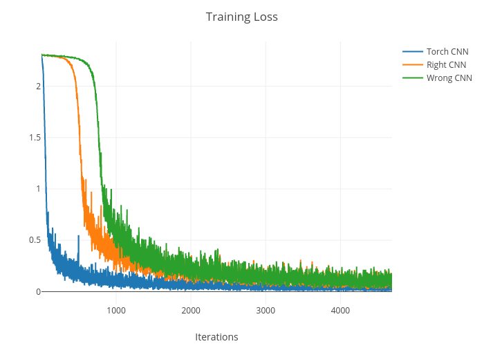

# nn-playground
 Have fun with neural networks

## What's done
* MNIST
  * Implementing neural networks using PyTorch
    * A linear network
      * Achieved 92% accuracy
    * A fully connected network
      * Achieved 97% accuracy
    * A convolutional neural network
      * Achieved 99% accuracy
    * A deep convolutional neural network
      * Achieved 99.5% accuracy in 8 epochs
  * Implementing handmade neural networks using NumPy
    * A fully connected network
      * Achieved 95% accuracy with a simple SGD
        * Momentum alone didn't really help
    * A convolutional neural network
      * Achieved 98% accuracy with a simple SGD
      * Took 22 hours for just 10 epochs!
      * The loss didn't decrease during the 1st epoch
        * Was the initialization bad?
      * Also tried misimplementing bw_conv2d(), which actually worked for some reason...
        

## TODO
  * Display misclassified images
  * Try other datasets (Fashion MNIST, SVHN, ...)
  * Write a configuration file
  * Make nn_handmade.py neater as well
  * Try data augmentation
  * Try knowledge distillation
